# Enhanced Agentic Development Workflow s CheckAgent Kontrolou

## 🎯 Hlavní Principy

### Nulová Tolerance Pro

- ❌ Mock data
- ❌ Dummy variables
- ❌ TODO komentáře (kromě testů)
- ❌ Nedokončený kód
- ❌ Nedodržení standardů

### Povinné Pro Každý Úkol

- ✅ Kompletní implementace
- ✅ Dokumentace v README.md
- ✅ CheckAgent verifikace
- ✅ Dodržení všech standardů

---

## 📋 Workflow Popis

### Fáze 1: Orchestrator Přidělí Úkol

```
1. Orchestrator vyhodnotí celkový projekt stav
2. Identifikuje další mini-úkol (1 soubor/1 feature/1 konkrétní změna)
3. Připraví kontext a instrukce
4. Vybere příslušného DevAgent (1-6)
5. Spustí DevAgent s jasně definovaným úkolem
```

### Fáze 2: DevAgent Pracuje

```
DevAgent dostane:
- Konkrétní úkol (např. "Implementuj Content API endpoint pro vytváření postů")
- Relevantní soubory z projektu (max 14 souborů)
- Standardy (quality-standards.md)
- Předchozí kontext (pokud je re-run)

DevAgent:
1. Přečte si všechny poskytnuté soubory
2. Implementuje řešení BEZ mock dat, dummy variables, TODO
3. Po dokončení zapíše do README.md ve své pracovní složce:
   - Co bylo implementováno
   - Proč byla zvolena daná implementace
   - Jaké soubory byly změněny
   - Jaké závislosti byly přidány
```

### Fáze 3: CheckAgent Kontrola

```
CheckAgent dostane:
- Úkol DevAgenta
- Všechny změněné soubory
- quality-standards.md
- coding-standards.md
- Předchozí feedback (pokud je re-run)

CheckAgent kontroluje:
1. ❌ ŽÁDNÁ mock data
2. ❌ ŽÁDNÉ dummy variables
3. ❌ ŽÁDNÉ TODO komentáře
4. ✅ Kompletní implementace
5. ✅ Dodržení coding standards
6. ✅ Správné error handling
7. ✅ Dokumentace v kódu
8. ✅ Type safety (pokud TypeScript)
9. ✅ Security best practices
10. ✅ Performance considerations

CheckAgent zapíše za **|** v README.md:
- PASS/FAIL status
- Seznam problémů (pokud nějaké jsou)
- Konkrétní řádky kódu s problémy
- Doporučení pro opravu
```

### Fáze 4: Orchestrator Rozhoduje

```
Orchestrator přečte README.md a rozhodne:

1. ✅ PASS → Pokračuj na další úkol
   - Integruj změny do main projektu
   - Označ úkol jako hotový
   - Přejdi na další DevAgent nebo další mini-úkol

2. ❌ FAIL → Re-run
   a) DevAgent znovu spustit s feedback od CheckAgent
   b) CheckAgent znovu spustit pro re-check
   c) Případně změnit strategii řešení

3. 🤔 CLARIFY → Vyžádej další kontext
   - Které soubory potřebuje DevAgent číst?
   - Jsou potřeba další standardy?
   - Je potřeba rozdělit úkol na menší části?
```

---

## 📁 Struktura Souborů

```
project/
├── .agentic/
│   ├── standards/
│   │   ├── quality-standards.md          # Master quality checklist
│   │   ├── coding-standards.md           # Coding conventions
│   │   ├── security-standards.md         # Security requirements
│   │   └── documentation-standards.md    # Docs requirements
│   │
│   ├── agents/
│   │   ├── agent-1-backend-core/
│   │   │   ├── current-task.md
│   │   │   ├── README.md                 # DevAgent popis **|** CheckAgent result
│   │   │   └── working/                  # Pracovní soubory
│   │   │
│   │   ├── agent-2-ai-pipeline/
│   │   │   ├── current-task.md
│   │   │   ├── README.md
│   │   │   └── working/
│   │   │
│   │   ├── agent-3-realtime/
│   │   ├── agent-4-billing/
│   │   ├── agent-5-frontend/
│   │   └── agent-6-devops/
│   │
│   └── orchestrator/
│       ├── master-plan.md                # Celkový projekt plán
│       ├── current-state.md              # Aktuální stav projektu
│       ├── completed-tasks.md            # Hotové úkoly
│       └── failed-attempts.md            # Neúspěšné pokusy + lessons learned
│
└── [běžná struktura projektu]
```

---

## 🔄 README.md Formát

Každý agent má svůj `README.md` ve formátu:

```markdown
# Agent N - [Název Agenta]

## 🎯 Aktuální Úkol
[Popis úkolu od Orchestratora]

## 📝 DevAgent Implementace

### Co bylo implementováno
- Feature X v souboru Y
- Endpoint Z pro service W
- Tests pro všechny případy

### Proč tato implementace
- Důvod A: [vysvětlení]
- Důvod B: [vysvětlení]

### Změněné soubory
1. `/src/api/content.ts` - Přidán POST endpoint
2. `/src/services/contentService.ts` - Business logika
3. `/tests/api/content.test.ts` - Unit tests

### Přidané závislosti
- zod@3.22.0 - Schema validation
- uuid@9.0.0 - ID generování

### Poznámky
[Případné další poznámky]

**|**

## ✅ CheckAgent Kontrola

### Status: [PASS/FAIL]

### Kontrolované Oblasti
✅ Mock Data: Žádná nalezena
✅ Dummy Variables: Žádné nalezeny
✅ TODO Komentáře: Žádné nalezeny (mimo testy)
✅ Kompletnost: Plná implementace
✅ Coding Standards: Dodrženy
✅ Error Handling: Implementován
✅ Type Safety: Správný typing
✅ Security: Best practices dodrženy
✅ Performance: Optimalizované

### Nalezené Problémy
[Pokud FAIL, zde seznam problémů]

1. **[Soubor:řádek]** - [Problém]
   - Nalezeno: `[kód]`
   - Důvod: [Proč je to problém]
   - Fix: [Jak to opravit]

### Doporučení
[Konkrétní kroky pro opravu nebo vylepšení]
```

---

## 🎭 Agent Definitions

### Agent 1: Backend Core

**Zodpovědnost:**

- Content API endpoints
- Auto-assignment logika
- Core business services
- Database schema & migrations

**Dependencies:** Žádné (base layer)

**Check Standards:**

- RESTful API conventions
- Database transaction safety
- Input validation (zod schemas)
- Authentication/Authorization checks

---

### Agent 2: AI Pipeline

**Zodpovědnost:**

- AI Gateway integrace
- Provider management (OpenAI, Anthropic, local)
- Prompt templating
- Response processing

**Dependencies:** Agent 1 (API infrastructure)

**Check Standards:**

- Provider fallback logic
- Rate limiting
- Error handling pro API failures
- Prompt injection protection

---

### Agent 3: Realtime

**Zodpovědnost:**

- SSE implementation
- Real-time notifications
- WebSocket fallback
- Client state sync

**Dependencies:** Agent 1 (API) + Agent 2 (AI events)

**Check Standards:**

- Connection stability
- Memory leak prevention
- Proper event cleanup
- Error recovery

---

### Agent 4: Billing

**Zodpovědnost:**

- Stripe integration
- Usage tracking
- Limit enforcement
- Subscription management

**Dependencies:** Agent 1 (API) + Agent 2 (usage data)

**Check Standards:**

- Stripe webhook security
- Idempotency
- Transaction atomicity
- Audit logging

---

### Agent 5: Frontend (Angular)

**Zodpovědnost:**

- Angular 19 components
- Standalone components
- Signals & RxJS
- API integration

**Dependencies:** All backend agents (APIs)

**Check Standards:**

- Accessibility (a11y)
- Responsive design
- Performance (bundle size)
- Type safety (TypeScript)

---

### Agent 6: DevOps & QA

**Zodpovědnost:**

- E2E tests
- CI/CD pipelines
- Documentation
- Deployment scripts

**Dependencies:** All agents (integration testing)

**Check Standards:**

- Test coverage > 80%
- E2E scenarios complete
- Documentation up-to-date
- Zero security vulnerabilities

---

## 📊 Orchestrator Decision Flow

```
START
  ↓
Read master-plan.md & current-state.md
  ↓
Select next mini-task
  ↓
Determine which agent(s) needed
  ↓
Check dependencies ready?
  ├─ NO → Queue task, work on different task
  └─ YES → Continue
      ↓
Prepare context (max 14 files)
      ↓
Create current-task.md for agent
      ↓
LAUNCH DevAgent
      ↓
Wait for DevAgent README.md update
      ↓
LAUNCH CheckAgent
      ↓
Wait for CheckAgent README.md update
      ↓
Read complete README.md
      ↓
Analyze result
      ├─ PASS → Integrate & Next Task
      ├─ FAIL → Re-run DevAgent with feedback
      └─ CLARIFY → Get more context, update task
```

---

## 🎨 Mermaid Diagram (Full Flow)

```mermaid
graph TB
    Start([🎬 START]) --> Orch{Orchestrator<br/>Vybere Mini-Úkol}
    
    Orch -->|Úkol definován| Prep[📋 Připraví Kontext<br/>- Max 14 souborů<br/>- Standards<br/>- Previous context]
    
    Prep --> Dev1[🤖 Agent 1<br/>Backend Core]
    Prep --> Dev2[🤖 Agent 2<br/>AI Pipeline]
    Prep --> Dev3[🤖 Agent 3<br/>Realtime]
    Prep --> Dev4[🤖 Agent 4<br/>Billing]
    Prep --> Dev5[🤖 Agent 5<br/>Frontend]
    Prep --> Dev6[🤖 Agent 6<br/>DevOps QA]
    
    Dev1 --> DevWork[💻 DEV PRACUJE<br/>- Implementuje<br/>- Zapisuje README.md]
    Dev2 --> DevWork
    Dev3 --> DevWork
    Dev4 --> DevWork
    Dev5 --> DevWork
    Dev6 --> DevWork
    
    DevWork --> CheckStart[🔍 CheckAgent START]
    
    CheckStart --> Check1{❌ Mock Data?}
    Check1 -->|ANO| Fail[❌ FAIL]
    Check1 -->|NE| Check2{❌ Dummy Vars?}
    
    Check2 -->|ANO| Fail
    Check2 -->|NE| Check3{❌ TODO Comments?}
    
    Check3 -->|ANO| Fail
    Check3 -->|NE| Check4{✅ Kompletní?}
    
    Check4 -->|NE| Fail
    Check4 -->|ANO| Check5{✅ Standards?}
    
    Check5 -->|NE| Fail
    Check5 -->|ANO| Check6{✅ Error Handling?}
    
    Check6 -->|NE| Fail
    Check6 -->|ANO| Check7{✅ Security?}
    
    Check7 -->|NE| Fail
    Check7 -->|ANO| Pass[✅ PASS]
    
    Fail --> CheckWrite[📝 CheckAgent<br/>Zapíše Feedback<br/>za **&#124;** v README.md]
    Pass --> CheckWrite
    
    CheckWrite --> OrchRead{Orchestrator<br/>Čte README.md}
    
    OrchRead -->|PASS| Integrate[✨ Integruj do Projektu]
    OrchRead -->|FAIL| ReRun{Re-run Strategy}
    OrchRead -->|CLARIFY| GetContext[📚 Vyžádej více kontextu]
    
    Integrate --> NextTask[➡️ Další Mini-Úkol]
    NextTask --> Orch
    
    ReRun -->|DevAgent s feedback| Dev1
    ReRun -->|CheckAgent znovu| CheckStart
    ReRun -->|Změnit strategii| Prep
    
    GetContext --> Prep
    
    style Start fill:#4CAF50,stroke:#2E7D32,stroke-width:3px,color:#fff
    style Pass fill:#4CAF50,stroke:#2E7D32,stroke-width:3px,color:#fff
    style Fail fill:#f44336,stroke:#c62828,stroke-width:3px,color:#fff
    style Orch fill:#2196F3,stroke:#1565C0,stroke-width:2px,color:#fff
    style CheckStart fill:#FF9800,stroke:#E65100,stroke-width:2px,color:#fff
    style Integrate fill:#4CAF50,stroke:#2E7D32,stroke-width:2px,color:#fff
```



---

## 📝 Quality Standards Template

```markdown
# quality-standards.md

## 🚫 Zakázané Elementy
1. Mock data - NIKDY
2. Dummy variables - NIKDY
3. TODO komentáře - NIKDY (kromě testů)
4. Nedokončený kód - NIKDY
5. console.log v produkci - NIKDY
6. Hardcoded credentials - NIKDY
7. Ignorované errors - NIKDY

## ✅ Povinné Elementy
1. Error handling pro VŠECHNY external calls
2. Input validation (zod schemas)
3. Type safety (žádné 'any' bez důvodu)
4. Security checks (auth, authorization, rate limiting)
5. Dokumentace v kódu (JSDoc/TSDoc)
6. Unit tests pro business logiku
7. Integration tests pro API endpoints

## 🎯 Coding Standards
### TypeScript/JavaScript
- Používej strict mode
- Preferuj const před let
- Používej destructuring
- Async/await místo .then()
- Named exports místo default

### API Design
- RESTful konvence
- Consistent error responses
- Pagination pro lists
- Rate limiting
- CORS properly configured

### Database
- Transactions pro multi-step operations
- Proper indexing
- Migration scripts
- Seed data separated from migrations

### Security
- Input sanitization
- SQL injection prevention
- XSS protection
- CSRF tokens
- JWT validation
- Environment variables pro secrets
```

---

## 🚀 Implementační Kroky

### 1. Setup Standardů

```bash
# Vytvořit strukturu
mkdir -p .agentic/standards
mkdir -p .agentic/agents/{agent-1-backend-core,agent-2-ai-pipeline,agent-3-realtime,agent-4-billing,agent-5-frontend,agent-6-devops}/working
mkdir -p .agentic/orchestrator

# Vytvořit standard soubory
touch .agentic/standards/quality-standards.md
touch .agentic/standards/coding-standards.md
touch .agentic/standards/security-standards.md
touch .agentic/standards/documentation-standards.md
```

### 2. Inicializace Master Plan

```bash
# Orchestrator vytvoří master plan
touch .agentic/orchestrator/master-plan.md
touch .agentic/orchestrator/current-state.md
touch .agentic/orchestrator/completed-tasks.md
touch .agentic/orchestrator/failed-attempts.md
```

### 3. První Mini-Úkol

```
1. Orchestrator vybere Agent 1 (Backend Core)
2. Vytvoří current-task.md s detailním popisem
3. Poskytne relevantní soubory (max 14)
4. Spustí DevAgent → README.md update
5. Spustí CheckAgent → README.md update za **|**
6. Rozhodne další krok
```

---

## 🎯 Příklad Workflow Run

### Mini-Úkol: "Implementovat Content API endpoint pro vytváření postů"

#### 1. Orchestrator Příprava

```markdown
# .agentic/agents/agent-1-backend-core/current-task.md

## Úkol
Implementovat POST /api/content/posts endpoint

## Požadavky
- Validace inputu pomocí zod
- Ukládání do DB (Prisma)
- Auth required
- Rate limiting
- Error handling

## Poskytnuté Soubory
1. src/api/content.ts (existující)
2. src/services/contentService.ts (nový)
3. src/schemas/content.schema.ts (nový)
4. prisma/schema.prisma (existující)
5. .agentic/standards/quality-standards.md
6. .agentic/standards/coding-standards.md

## Expected Output
- Funkční endpoint
- Unit tests
- Integration tests
- README.md dokumentace
```

#### 2. DevAgent Implementuje

```typescript
// src/api/content.ts
import { z } from 'zod';
import { contentService } from '../services/contentService';
import { requireAuth } from '../middleware/auth';
import { rateLimit } from '../middleware/rateLimit';

const createPostSchema = z.object({
  title: z.string().min(1).max(200),
  content: z.string().min(1),
  aiPersonaId: z.string().uuid(),
});

router.post('/posts', 
  requireAuth,
  rateLimit({ max: 10, windowMs: 60000 }),
  async (req, res) => {
    try {
      const validated = createPostSchema.parse(req.body);
      const post = await contentService.createPost({
        ...validated,
        userId: req.user.id,
      });
      res.status(201).json(post);
    } catch (error) {
      if (error instanceof z.ZodError) {
        return res.status(400).json({ error: error.errors });
      }
      res.status(500).json({ error: 'Internal server error' });
    }
  }
);
```

DevAgent zapíše do README.md:

```markdown
## 📝 DevAgent Implementace

### Co bylo implementováno
- POST /api/content/posts endpoint v src/api/content.ts
- contentService.createPost() v src/services/contentService.ts
- Zod schema pro validaci v src/schemas/content.schema.ts
- Unit tests v tests/services/contentService.test.ts
- Integration tests v tests/api/content.test.ts

### Proč tato implementace
- Zod pro type-safe validaci: Eliminuje runtime errors
- Samostatný service layer: Testovatelnost a reusabilita
- Rate limiting: Ochrana proti abuse
- Error handling: Správné HTTP status kódy a error messages

### Změněné soubory
1. src/api/content.ts - Přidán POST endpoint
2. src/services/contentService.ts - NOVÝ soubor s business logikou
3. src/schemas/content.schema.ts - NOVÝ soubor se zod schemas
4. tests/services/contentService.test.ts - NOVÝ soubor s unit testy
5. tests/api/content.test.ts - NOVÝ soubor s integration testy

### Přidané závislosti
- zod@3.22.4 - Schema validation (již v projektu)
- uuid@9.0.1 - ID generování (již v projektu)

### Poznámky
- Všechny tests PASSují
- Code coverage 95%
- Žádné TODO, mock data ani dummy variables
```

#### 3. CheckAgent Kontroluje

```markdown
**|**

## ✅ CheckAgent Kontrola

### Status: PASS ✅

### Kontrolované Oblasti
✅ Mock Data: Žádná nalezena
✅ Dummy Variables: Žádné nalezeny
✅ TODO Komentáře: Žádné nalezeny
✅ Kompletnost: Plná implementace včetně testů
✅ Coding Standards: Dodrženy (async/await, const, destructuring)
✅ Error Handling: Kompletní (zod errors + generic errors)
✅ Type Safety: Správný typing všude
✅ Security: Auth middleware + rate limiting + input validation
✅ Performance: Optimální (žádné N+1 queries)
✅ Tests: 95% coverage, všechny PASSují

### Nalezené Problémy
Žádné!

### Doporučení
Implementace je production-ready. Můžeme integrovat do main.
```

#### 4. Orchestrator Rozhodne

```markdown
# .agentic/orchestrator/current-state.md

## Poslední Aktualizace
Agent 1 - Backend Core: Content API - PASS ✅

## Rozhodnutí
- Status: PASS
- Action: Integrovat do main
- Next Task: Agent 2 - AI Pipeline - Připojit content API k AI generování

## Integration Steps
1. Merge agent-1 working files do main
2. Run full test suite
3. Update API documentation
4. Mark task as completed
```

---

## 🔧 Troubleshooting

### Problem: CheckAgent stále nachází TODO komentáře

**Solution:**

1. DevAgent musí před submit udělat search: `grep -r "TODO" src/`
2. Odstranit všechny nalezené TODO
3. CheckAgent znovu zkontroluje

### Problem: Mock data v kódu

**Solution:**

1. CheckAgent identifikuje přesné řádky
2. DevAgent nahradí real implementací
3. Pokud je potřeba více kontextu, Orchestrator poskytne další soubory

### Problem: Příliš velký úkol pro jednoho DevAgenta

**Solution:**

1. Orchestrator rozdělí úkol na menší mini-úkoly
2. Vytvoří dependency chain
3. Spustí postupně

---

## 📈 Metrics & Tracking

### Per-Agent Metrics

- Tasks completed
- Pass rate (first attempt)
- Average re-runs needed
- Time per task
- Lines of code changed

### Overall Metrics

- Total tasks completed
- Overall pass rate
- Bottleneck agents
- Most common failures
- Integration success rate

---

## 🎓 Best Practices

### Pro DevAgenty

1. ✅ Vždy čti všechny poskytnuté soubory PŘED implementací
2. ✅ Implementuj KOMPLETNĚ - žádné TODO
3. ✅ Piš testy SOUČASNĚ s kódem
4. ✅ Dokumentuj DŮVODY svých rozhodnutí v README.md
5. ✅ Kontroluj vlastní kód před submitem (self-check)

### Pro CheckAgenty

1. ✅ Buď přísný - ZERO TOLERANCE pro mock data/dummy vars/TODO
2. ✅ Poskytuj KONKRÉTNÍ feedback (soubor:řádek)
3. ✅ Navrhuj ŘEŠENÍ, ne jen problémy
4. ✅ Kontroluj VŠECHNY standardy
5. ✅ Buď konstruktivní v feedbacku

### Pro Orchestratora

1. ✅ Definuj mini-úkoly JASNĚ a KONKRÉTNĚ
2. ✅ Poskytni SPRÁVNÝ kontext (max 14 souborů)
3. ✅ Respektuj dependencies mezi agenty
4. ✅ Uč se z failed attempts
5. ✅ Udržuj master plan aktuální

---

## 🎉 Success Criteria

Workflow je úspěšný když:

- ✅ 90%+ pass rate na první pokus
- ✅ Žádné mock data v produkci
- ✅ Všechny standardy dodrženy
- ✅ Dokumentace kompletní
- ✅ Tests PASSují
- ✅ Code review ready
- ✅ Production ready

---

## 📚 Reference Files

Vytvořit tyto soubory pro úplnou implementaci:

1. `.agentic/standards/quality-standards.md` - Kompletní quality checklist
2. `.agentic/standards/coding-standards.md` - Coding conventions
3. `.agentic/standards/security-standards.md` - Security requirements
4. `.agentic/standards/documentation-standards.md` - Docs requirements
5. `.agentic/standards/testing-standards.md` - Testing requirements
6. `.agentic/orchestrator/master-plan.md` - Project master plan
7. `.agentic/orchestrator/agent-dependencies.md` - Agent dependency graph

---

**Verze:** 1.0.0  
**Poslední Update:** 2024-12-17  
**Autor:** Martin - Praut s.r.o.  
**Pro Projekt:** PostHub SaaS Platform
